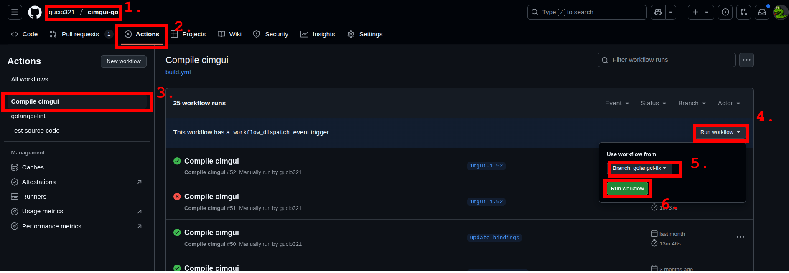
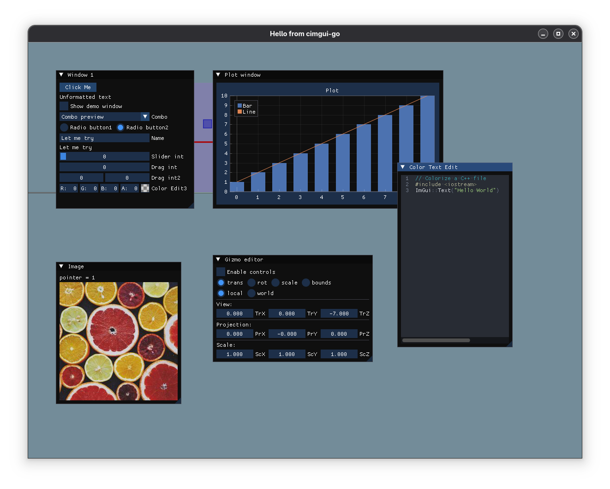

# cimgui-go 

This project aims to generate go wrapper for Dear ImGui.

It comes with [several default backends](supported-backends) implemented.

It works on macOS(arm64/x86), windows(x64), Arch Linux (Gnome/KDE) and Fedora Workstation 36+, idealy other linux GUI should works as well. Check out [`examples`](./examples): cd in and `go run .`.

> [!note]
> It is a known issue that newer versions of cimgui-go does not compile on some older linux distributions (e.g. Debian).
> This is caused by shared libraries being compiled with GitHub Actions version of Ubuntu ([check out this table for the exact Ubunt version](https://docs.github.com/en/actions/how-tos/using-github-hosted-runners/using-github-hosted-runners/about-github-hosted-runners#standard-github-hosted-runners-for-public-repositories)) and not being compatible with older versions of glibc.
> Track [#157](https://github.com/AllenDang/cimgui-go/issues/157).

## Setup

There are several dependencies you might need to install on your linux machine.
Take a look [here](https://github.com/allendang/giu#install)

## Module overview

This module contains several packages that may need some explanation:

| Package | Description |
| ------- | ----------- |
| `imgui`, `implot`, `imnodes`, e.t.c. | Actual Dear ImGui (and plugins) bindings. Used to display widgets and other UI stuff. |
| `examples` | Just like the name suggests - a handful of examples that show how to use cimgui-go |
| `cmd/codegen` | Code generator that generates Go bindings. |
| `backend`  | Abstraction layer for various backends (glfw, sdl, ebiten, e.t.c.). |
| `backend/*` | Specific backends (implements `backend.Bckend`) utilizing system libraries to render ImGui. |
| `impl`     | Packages responsible for imgui <-> backend interactions. (Use them if you want to implement your own backend. Not needed if using one of `backend/*` implementations). |
| `cwrappers` | C wrappers for Dear ImGui and the team. Contains also source (C++) code. |
| `lib`     | Pre-compiled set of libraries that are used to link with cimgui-go. Contains static libraries for ImGui, GLFW, SDL2 and other dependencies. |
| `thirdparty` | 3rd party headers like GLFW and SDL2. Used by backend. |
| `utils`   | some utiliity functions that are used by cimgui-go. Also contains `Vector` implementation. |
| `templates` (not package) | Stores files used during generation. |

## Supported Backends

In order to make it easy in use, cimgui-go implemented a few imgui backends. All of them are placed in `backend/` sub-packages.
To see more details about usage of a specific backend, take a look at the [examples](./examples).

We support the following backends:
- [GLFW](./examples/glfw). (GLFW 3.3 + OpenGL)
- [SDL2](./examples/sdl). (SDL 2 + OpenGL)
- [Ebitengine](./examples/ebiten) (`import "github.com/AllenDang/cimgui-go/backend/ebitenbackend"`).

> [!important]
> Remember that various solution use different C libraries that can conflict with each other.
> It is recommended not to import e.g. GLFW and SDL backends at the same time as it may result in linker crash.

## Naming convention

- For functions, 'Im/ImGui/ig' is trimmed.
- `Get` prefix is also removed (with some exceptions).
- If function comes from `imgui_internal.h`, `Internal` prefix is added.

## Pointers and Slices

Unfortunately, in C there is no way to distinguish between a pointer and a slice.
We had to bring this inconvenience to Go as well.
Our code defaults to pointers, but you can easily convert your slice to a pointer by simply `&(slice[0])`.

> [!tip]
> There are some utility functions in `utils` package including:
> - `utils.SliceToPtr(slice []T) *T` - converts a slice to a pointer.
> - `utils.PtrToSlice(ptr *T, size int) []T` - converts a pointer to a slice of given size. **Be careful with size! This may cause segmentation fault if used incorrectly.**

## Callbacks

Please note that at the moment (June 2025) go (1.24) does not support passing annonymous functions to C via CGO.
We have a workaround - pre-generating large amount of global functions and a pool.
For details see https://github.com/AllenDang/cimgui-go/issues/224.
Just be aware of the limitation that you may run out of pre-generated pool and experience a crash.

## Function coverage
Currently most of the functions are generated, except memory related stuff (eg. memory allocator, storage management, etc...).
If you find any function is missing, report an issue.

# Contribution
All kinds of contributions are welcome!

> [!warning]
> You will **NEVER** want to modify auto-generated files manually! (sufficient comments are placed on top of each file)
> All Pull Requests violating this rule will not pass automatic checks and will not be merged.

## Current solution is:
1. Use [cimgui](https://github.com/cimgui/cimgui)'s lua generator to generate function and struct definition as json.
2. Generate proper go code from the definition ([via manual crafted go program](./cmd/codegen)).
3. Use [the backend implementation](#supported-backends) from imgui.
4. Use github workflow to compile cimgui, glfw and other C dependencies to static lib and place them in ./lib folder for further link. 

Your contributions may apply to several areas:

## Code generation

A way  the actual binding is generated.
Such a modifications should be made in `cmd/codegen` module.
> [!tip]
> It is recommended to commit code re-generation separately from codegen modifications (however this is not a rule).

To actually generate Go binding, you need the following setup:
- Install [GNU make](https://www.gnu.org/software/make/manual/make.html)
- You'll also need Go :smile:

Then, just run `make`, or `make XXX` where `XXX` is the name of a package you want to generate (e.g. `make imgui`, `make implot`, etc.).

## Hardcoded bindings

There are some files in the wrapper that have been hardcoded and are not auto-generated. These include (but are not limited to):
- `imgui/extra_types.go`
- `imgui/extra_types.h`
- `imgui/clipboard.go`

> [!note]
> These files cuold be safely modified if you think they should be.

Same applies to the `backend/` packages.

## Updating plugins

We have a special system to make it easier to update dependencies. In order to issue an update, do the following:
- Make sure you have luajit installed on your system.
- Run `make update`. This will take a while as it will redownload all dependencies and regenerate the whole C and Go bindings.
- Commit your changes and push them to GitHub.
- Execute cimgui compilation as described below:

How to run cimgui compilation on GitHub

1. Go to your fork
2. Navigate to the "Actions" tab
3. Select "Compile cimgui" workflow tab
4. Click on "Run workflow" button
5. Select the branch you want to run the workflow on
6. Click "Run workflow" button

### Pre-compile code locally

> [!warning]
> **Do not** push pre-compiled code from your local machine! This may contain your local paths and you might not want to share them with the world. Let GitHub Actions do the compilation.

As GitHub Actions are a bit slow sometimes, this might be useful to speed-up development process on your local machine.
To pre-compile code locally, do the following:
- Make sure you have `cmake` as well as appropiate C/C++ toolchain installed on your system.
- Enter the `lib` directory.
- Run `cmake -Bbuild .`
- Then, `cd build` and run `make -j$(nproc)` to compile all imgui libraries.
- Copy `cimgui.a` to `lib/<your operatign system>/<your architecture>/cimgui.a`

## Pre-compiled code

To speed-up final Go build process, we pre-compile C/C++ libraries and place them in `libs/` directory.

These libraries are:
- ImGui and all its plugins (implot, imnodes, e.t.c.)
- GLFW, SDL2 backend components.

This unfortunately means that some operating systems will not work out of the box.
Currently, we compile against the following operating systems:
- macOS (arm64/x86_64)
- Windows (x86_64)
- Linux (x86_64)

If you run any system that is not listed above, you will need to compile the libraries yourself before using cimgui-go.
[Follow these instructions.](#pre-compile-code-locally). If you succeeded, please let us know by opening an issue (or a pull request) so we can try to add support for your system.

> [!important]
> Pre-compiled shared library is linked in files called `cflags.go`. You can find a global template in `templates/cflags.go.template`. After modifying it, just run a normal generation and it should update everywhere.

# Gallery

